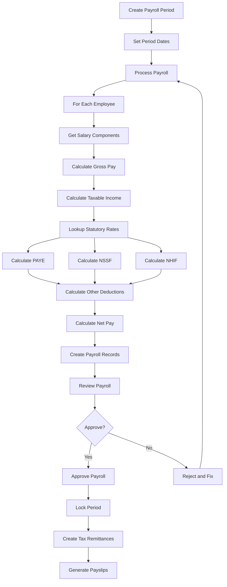
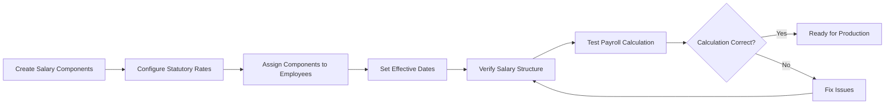
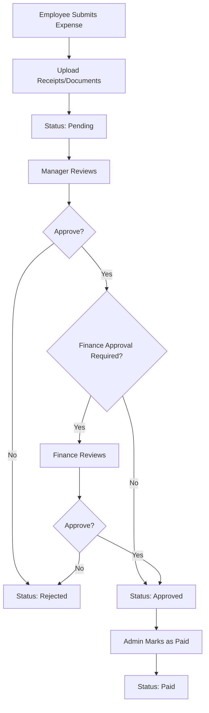
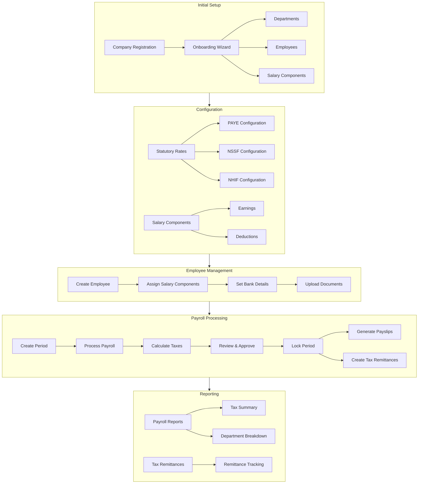

# Complete System Guide

## Table of Contents

1. [Overview](#overview)
2. [Initial Setup](#initial-setup)
3. [Employee Management](#employee-management)
4. [Salary Structure Setup](#salary-structure-setup)
5. [Payroll Processing](#payroll-processing)
6. [Expense Management](#expense-management)
7. [Loan Management](#loan-management)
8. [Reporting and Analytics](#reporting-and-analytics)
9. [System Administration](#system-administration)

## Overview

This guide provides a comprehensive walkthrough of the Payroll & Expense Management System, covering all major features and workflows from initial setup to daily operations.

### System Capabilities

- **Employee Management**: Complete employee lifecycle management
- **Payroll Processing**: Automated payroll calculation and processing
- **Tax Management**: Statutory tax calculations (PAYE, NSSF, NHIF) and remittance tracking
- **Expense Management**: Employee expense submission and approval workflow
- **Loan Management**: Employee loan tracking and automatic deductions
- **Reporting**: Comprehensive payroll and expense reports
- **Multi-tenant**: Support for multiple organizations

## Initial Setup

### Step 1: Company Registration

1. Navigate to the registration page
2. Fill in company details:
   - **Organization Name**: Your company name
   - **Organization Subdomain**: Unique identifier (e.g., "acme-corp")
   - **Admin User Details**:
     - First Name
     - Last Name
     - Email (this becomes your login email)
     - Password (minimum 8 characters)
3. Click **"Register"**
4. System automatically:
   - Creates your organization (tenant)
   - Creates your admin user account
   - Assigns you the "Admin" role with all permissions
   - Logs you in automatically

### Step 2: Onboarding Wizard (Optional)

After registration, you'll be guided through an optional onboarding process:

**Step 1: Welcome**
- Introduction to the system
- Overview of features

**Step 2: Departments**
- Create organizational departments
- Add department names and codes
- Can add multiple departments
- Can skip and add later

**Step 3: Employees**
- Add your first employees
- Enter basic employee information
- Assign to departments
- Can skip and add later

**Step 4: Salary Components**
- Configure salary structure
- Pre-filled with common components
- Can modify or add more
- Can skip and configure later

**Step 5: Complete**
- Setup summary
- Next steps guidance

**Note**: You can skip any step and complete setup later from the respective pages.

### Step 3: Essential Configuration

Before processing your first payroll, complete these essential steps:

1. **Configure Statutory Rates** (See [Statutory Rates Guide](./STATUTORY_RATES_GUIDE.md))
   - Set up PAYE brackets
   - Set up NSSF rate
   - Set up NHIF tiers

2. **Create Salary Components** (See [Salary Components Guide](./SALARY_COMPONENTS_GUIDE.md))
   - Basic Salary
   - Allowances (Transport, House, Medical, etc.)
   - Statutory components (PAYE, NSSF, NHIF) for display

3. **Add Departments** (if not done in onboarding)
   - Navigate to Departments
   - Add all organizational departments

4. **Add Employees** (if not done in onboarding)
   - Navigate to Employees
   - Add employee information
   - Assign to departments

## Employee Management

### Creating an Employee

1. Navigate to **Employees** page
2. Click **"Add Employee"** button
3. Fill in employee form sections:

#### Section 1: Personal Information
- First Name, Middle Name, Last Name
- Date of Birth
- Gender, Marital Status, Nationality
- Photo (optional upload)

#### Section 2: Contact Information
- Personal Email
- Work Email (required if creating user account)
- Primary Phone, Secondary Phone

#### Section 3: Address Information
- Address Line 1, Address Line 2
- City, County, Postal Code, Country

#### Section 4: Identification
- National ID Number
- Passport Number (optional)
- KRA PIN (for tax purposes)
- NSSF Number
- NHIF Number

#### Section 5: Employment Details
- Job Title
- Job Grade
- Department (select from existing departments)
- Employment Type (Permanent, Contract, Casual, Intern)
- Hire Date
- Probation End Date (if applicable)
- Contract End Date (if applicable)

#### Section 6: Emergency Contact
- Contact Name
- Contact Phone
- Relationship

#### Section 7: User Account & Role (Optional)
- Checkbox: "Create user account for this employee"
- If checked:
  - Select Role from dropdown
  - Enter Password
  - User account created using work email

4. Click **"Create Employee"**
5. After creation, you can add:
   - Bank Details (Section 8)
   - Documents (Section 9)

### Editing an Employee

1. Navigate to **Employees** page
2. Click **Edit** icon on employee row
3. Modify information
4. Click **"Update Employee"**

**Note**: User account section is not shown when editing (user accounts managed separately).

### Managing Employee Bank Details

1. Open employee form (create or edit)
2. After employee is created, **Bank Details** section appears
3. Add bank account information:
   - Payment Method (Bank Transfer, M-Pesa)
   - Bank Name, Branch
   - Account Number
   - Account Name
   - SWIFT Code (for international)
   - M-Pesa Phone and Name (if applicable)
   - Mark as Primary
4. Can add multiple bank details
5. Changes saved immediately

### Managing Employee Documents

1. Open employee form (create or edit)
2. After employee is created, **Documents** section appears
3. Upload documents:
   - Click **"Upload Document"**
   - Select file
   - Enter Document Type and Description
   - Upload
4. View, download, or delete existing documents
5. Changes saved immediately

### Assigning Salary Components to Employees

1. Navigate to **Employees** page
2. Click on an employee
3. Go to **Salary** tab
4. Click **"Add Component"** or **"Assign Components"**
5. Select salary components
6. Enter amounts for each component
7. Set **Effective From** date
8. Click **"Save"**

See [Salary Components Guide](./SALARY_COMPONENTS_GUIDE.md) for detailed instructions.

## Salary Structure Setup

### Complete Workflow

#### Step 1: Create Salary Components

1. Navigate to **Salary > Components**
2. Create all necessary components:
   - **Earnings**: Basic Salary, Allowances, Bonuses
   - **Deductions**: Loans, Advances, Insurance
   - **Statutory**: PAYE, NSSF, NHIF (for display)

See [Salary Components Guide](./SALARY_COMPONENTS_GUIDE.md) for detailed component creation.

#### Step 2: Configure Statutory Rates

1. Navigate to **Admin > Statutory Rates**
2. Configure PAYE brackets
3. Configure NSSF rate
4. Configure NHIF tiers

See [Statutory Rates Guide](./STATUTORY_RATES_GUIDE.md) for detailed rate configuration.

#### Step 3: Assign Components to Employees

1. Navigate to **Employees**
2. For each employee:
   - Go to Salary tab
   - Assign components with amounts
   - Set effective dates

#### Step 4: Verify Salary Structure

1. Review employee salary pages
2. Check that all components are assigned correctly
3. Verify amounts are correct
4. Check effective dates

#### Step 5: Test Payroll Calculation

1. Create a test payroll period
2. Process payroll for one employee
3. Verify calculations:
   - Gross pay = sum of earnings
   - Taxable income = gross pay - non-taxable components
   - PAYE, NSSF, NHIF calculated correctly
   - Net pay = gross pay - all deductions

## Payroll Processing

### Creating a Payroll Period

1. Navigate to **Payroll > Periods**
2. Click **"Create Period"**
3. Fill in period details:
   - **Period Name**: e.g., "Payroll January 2026"
   - **Start Date**: First day of the period
   - **End Date**: Last day of the period
   - **Pay Date**: Date when employees will be paid
4. Click **"Create"**
5. Period created with status **"draft"**

**Validation:**
- No overlapping periods allowed
- Dates must be valid
- Pay date should be after end date

### Processing Payroll

1. Select a payroll period from the list
2. Click **"Process Payroll"** button
3. System automatically:
   - Gets all active employees
   - For each employee:
     - Calculates gross pay from salary components
     - Calculates taxable income
     - Looks up statutory rates
     - Calculates PAYE, NSSF, NHIF
     - Calculates other deductions (loans, advances)
     - Calculates net pay
     - Creates payroll record
4. Review payroll summary:
   - Total employees processed
   - Total gross pay
   - Total deductions
   - Total net pay
   - Tax totals (PAYE, NSSF, NHIF)

### Reviewing Payroll

1. After processing, review payroll details:
   - Click on period to view all payroll records
   - Check individual employee payrolls
   - Verify calculations
   - Review any warnings or errors

2. **Payroll Statuses:**
   - **Draft**: Period created but not processed
   - **Calculated**: Payroll processed, awaiting approval
   - **Approved**: Payroll approved, can be locked
   - **Locked**: Period locked, no further changes
   - **Paid**: Payments processed

### Approving Payroll

1. Review all payroll records
2. Verify calculations are correct
3. Click **"Approve Payroll"**
4. Period status changes to **"approved"**

### Locking Payroll Period

1. After approval, click **"Lock Period"**
2. Period status changes to **"locked"**
3. No further changes can be made
4. System automatically:
   - Creates tax remittance records
   - Generates payslips (if configured)

### Generating Payslips

1. After payroll is approved/locked
2. Navigate to employee's payroll record
3. Click **"Generate Payslip"**
4. System generates PDF payslip
5. Employee can view/download from their account

### Tax Remittance Tracking

When a payroll period is locked, the system automatically:
1. Creates tax remittance records for:
   - PAYE (if total > 0)
   - NSSF (if total > 0)
   - NHIF (if total > 0)
2. Sets due dates based on period end date
3. Marks remittances as "pending"

To manage remittances:
1. Navigate to **Reports > Tax Remittances**
2. View pending remittances
3. Mark as remitted when paid
4. Track remittance history

## Expense Management

### Creating Expense Categories

1. Navigate to **Expenses > Categories**
2. Click **"Add Category"**
3. Fill in:
   - Category Name
   - Description
   - Approval Required (yes/no)
4. Click **"Save"**

### Submitting an Expense

1. Navigate to **My Expenses** or **Expenses > Submit**
2. Click **"Submit Expense"**
3. Fill in expense form:
   - **Category**: Select expense category
   - **Department**: Select department (if applicable)
   - **Title**: Brief description
   - **Description**: Detailed description
   - **Amount**: Expense amount
   - **Currency**: Select currency
   - **Expense Date**: Date expense was incurred
   - **Receipts/Documents**: Upload supporting documents
4. Click **"Submit"**
5. Expense status: **"pending"**

### Approving Expenses

1. Navigate to **Expenses** page
2. View pending expenses
3. Click on an expense to review:
   - Expense details
   - Supporting documents
   - Amount and category
4. **Approve** or **Reject**:
   - If approved: Status changes to "approved"
   - May require finance approval (if configured)
   - If rejected: Add rejection reason
5. Once fully approved, can be marked as **"paid"**

### Expense Approval Workflow

**Two-Level Approval (if configured):**
1. **Manager Approval**: Department manager reviews and approves
2. **Finance Approval**: Finance team reviews and approves
3. **Payment**: Admin marks as paid

**Single-Level Approval:**
1. **Manager Approval**: Department manager reviews and approves
2. **Payment**: Admin marks as paid

## Loan Management

### Creating a Loan

1. Navigate to **Loans** page
2. Click **"Add Loan"**
3. Fill in loan details:
   - **Employee**: Select employee
   - **Loan Type**: Personal, Emergency, etc.
   - **Principal Amount**: Loan amount
   - **Interest Rate**: Annual interest rate (if applicable)
   - **Loan Term**: Number of months
   - **Start Date**: When loan becomes active
   - **Purpose**: Reason for loan
4. Click **"Create"**
5. Loan status: **"pending"** (requires approval)

### Approving Loans

1. Navigate to **Loans** page
2. View pending loans
3. Review loan details
4. **Approve** or **Reject**:
   - If approved: Loan becomes active
   - Automatic deduction setup
   - If rejected: Add rejection reason

### Loan Repayment

**Automatic Deduction:**
- System automatically deducts loan repayments from payroll
- Calculates monthly repayment amount
- Deducts from employee's net pay

**Manual Repayment:**
1. Navigate to loan details
2. Click **"Record Repayment"**
3. Enter repayment amount and date
4. System updates loan balance

### Viewing Loan Status

1. Navigate to **Loans** page
2. View loan list with status:
   - **Pending**: Awaiting approval
   - **Active**: Loan active, repayments in progress
   - **Completed**: Loan fully repaid
   - **Cancelled**: Loan cancelled

## Reporting and Analytics

### Payroll Reports

Navigate to **Reports > Payroll Reports**

**Available Report Types:**

1. **Monthly Summary**
   - Monthly breakdown of payroll
   - Employee count, gross pay, deductions, net pay
   - Tax totals by month

2. **Department Breakdown**
   - Payroll by department
   - Department-wise totals
   - Employee count per department

3. **Tax Summary**
   - Total PAYE, NSSF, NHIF
   - Monthly tax breakdown
   - Period breakdown
   - Department breakdown
   - Employee breakdown (optional)
   - Remittance status

4. **Trends**
   - Payroll trends over time
   - Gross pay trends
   - Net pay trends
   - Employee count trends

**Using Reports:**
1. Select report type
2. Set date range (start date, end date)
3. Apply filters (department, employee) if applicable
4. Click **"Generate Report"**
5. View results:
   - Charts and graphs
   - Data tables
   - Export options (CSV, Excel, PDF)

### Expense Reports

Navigate to **Reports > Expense Reports**

**Available Report Types:**

1. **By Category**
   - Expenses grouped by category
   - Total amounts per category
   - Percentage breakdown

2. **By Department**
   - Expenses by department
   - Department-wise totals
   - Average expense per department

3. **Monthly Trends**
   - Expense trends over time
   - Monthly totals
   - Average expenses

4. **Top Spenders**
   - Employees with highest expenses
   - Expense counts and totals

### Tax Remittance Reports

Navigate to **Reports > Tax Remittances**

**Features:**
- View all tax remittances
- Filter by status (pending, remitted)
- Filter by tax type (PAYE, NSSF, NHIF)
- Filter by date range
- Summary cards showing totals
- Mark remittances as remitted
- View remittance history

## System Administration

### Role Management

1. Navigate to **Admin > Roles**
2. View existing roles
3. **Create Role**:
   - Role name
   - Description
   - Permissions (select from list)
4. **Edit Role**: Modify permissions
5. **Delete Role**: Remove role (if not in use)

### Permission Management

1. Navigate to **Admin > Permissions**
2. View all available permissions
3. Permissions are organized by module:
   - Employee permissions
   - Payroll permissions
   - Expense permissions
   - Loan permissions
   - Report permissions
   - Admin permissions

### User Role Assignment

1. Navigate to **Admin > Roles**
2. Select a user
3. Click **"Assign Role"**
4. Select role and optional department
5. Role assigned

### Audit Logs

1. Navigate to **Admin > Audit Logs**
2. View system activity:
   - User actions
   - Data changes
   - Login attempts
   - System events
3. Filter by:
   - User
   - Action type
   - Date range
   - Module

### System Settings

1. Navigate to **Admin > Settings**
2. Configure system settings:
   - Payroll settings
   - Expense settings
   - Notification settings
   - General settings

### Statutory Rates Management

1. Navigate to **Admin > Statutory Rates**
2. Manage tax rates:
   - Create new rates
   - Update existing rates
   - Deactivate rates
   - View rate history

See [Statutory Rates Guide](./STATUTORY_RATES_GUIDE.md) for detailed instructions.

## Workflow Diagrams

### Complete Payroll Processing Flow

### Salary Structure Setup Flow

### Expense Approval Flow

### Complete System Architecture

## Best Practices

### Payroll Processing

1. **Process on Schedule**: Establish regular payroll processing schedule
2. **Review Before Approval**: Always review payroll before approving
3. **Lock Periods Promptly**: Lock periods after approval to prevent changes
4. **Track Remittances**: Monitor tax remittances and pay on time
5. **Keep Records**: Maintain payroll records for compliance

### Employee Management

1. **Complete Employee Data**: Ensure all required employee information is entered
2. **Keep Data Updated**: Update employee information when changes occur
3. **Document Management**: Upload and maintain employee documents
4. **Salary Reviews**: Regularly review and update employee salaries

### Expense Management

1. **Clear Policies**: Establish clear expense policies
2. **Require Receipts**: Require receipts for all expenses
3. **Timely Approval**: Process expense approvals promptly
4. **Track Spending**: Monitor expense trends and patterns

### System Maintenance

1. **Regular Backups**: Ensure regular system backups
2. **Update Rates**: Keep statutory rates updated
3. **Monitor Logs**: Review audit logs regularly
4. **User Training**: Train users on system features

## Next Steps

After reading this guide:

1. **Complete Initial Setup**: Follow the initial setup steps
2. **Configure Rates**: Set up statutory rates (see [Statutory Rates Guide](./STATUTORY_RATES_GUIDE.md))
3. **Create Components**: Set up salary components (see [Salary Components Guide](./SALARY_COMPONENTS_GUIDE.md))
4. **Add Employees**: Add your employees
5. **Process Test Payroll**: Run a test payroll to verify everything works
6. **Explore Features**: Explore expense management, loans, and reporting

For detailed information on specific topics:
- [Statutory Rates Guide](./STATUTORY_RATES_GUIDE.md) - Detailed rate configuration
- [Salary Components Guide](./SALARY_COMPONENTS_GUIDE.md) - Component setup and management
- [Troubleshooting Guide](./TROUBLESHOOTING_GUIDE.md) - Common issues and solutions
- [Quick Start Guide](./QUICK_START_GUIDE.md) - Quick reference and setup checklist
- [Configuration Templates](./CONFIGURATION_TEMPLATES.md) - Ready-to-use JSON templates for quick setup
