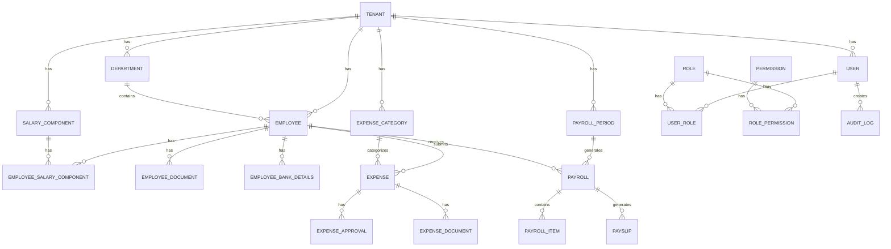

# Payroll & Expense Management System - Database Schema

## Overview

This document defines the complete database schema for the multi-tenant payroll and expense management system. The schema is designed for **PostgreSQL** with considerations for data integrity, auditability, and performance.

---

## Database Design Principles

1. **Multi-tenancy**: All tenant-specific tables include `tenant_id` for row-level isolation
2. **Audit Trail**: `created_at`, `updated_at`, `created_by`, `updated_by` on all tables
3. **Soft Deletes**: `deleted_at` for recoverable deletions
4. **UUID Primary Keys**: For security and distributed systems compatibility
5. **Normalized Structure**: Proper normalization with strategic denormalization for performance

---

## Entity-Relationship Diagram



---

## Schema Definitions

### 1. Multi-Tenancy & Organization

#### `tenants`

The root entity for multi-tenancy.

```sql
CREATE TABLE tenants (
    id UUID PRIMARY KEY DEFAULT gen_random_uuid(),
    name VARCHAR(255) NOT NULL,
    slug VARCHAR(100) UNIQUE NOT NULL,           -- Subdomain identifier
    logo_url VARCHAR(512),
    primary_color VARCHAR(7) DEFAULT '#3B82F6',  -- Branding color
    subscription_plan VARCHAR(50) DEFAULT 'basic',
    subscription_status VARCHAR(20) DEFAULT 'active',
    settings JSONB DEFAULT '{}'::jsonb,          -- Flexible settings

    -- Kenya-specific compliance fields
    kra_pin VARCHAR(20),
    company_registration_no VARCHAR(50),

    -- Audit fields
    created_at TIMESTAMP WITH TIME ZONE DEFAULT NOW(),
    updated_at TIMESTAMP WITH TIME ZONE DEFAULT NOW(),
    deleted_at TIMESTAMP WITH TIME ZONE,

    CONSTRAINT valid_subscription_status CHECK (subscription_status IN ('active', 'suspended', 'cancelled'))
);

CREATE INDEX idx_tenants_slug ON tenants(slug) WHERE deleted_at IS NULL;
```

#### `departments`

Organizational structure within a tenant.

```sql
CREATE TABLE departments (
    id UUID PRIMARY KEY DEFAULT gen_random_uuid(),
    tenant_id UUID NOT NULL REFERENCES tenants(id),
    name VARCHAR(255) NOT NULL,
    code VARCHAR(50),                            -- Department code (e.g., "FIN", "HR")
    parent_id UUID REFERENCES departments(id),   -- Hierarchical structure
    manager_id UUID,                             -- References employees(id) - set after employee creation
    description TEXT,
    is_active BOOLEAN DEFAULT true,

    -- Audit fields
    created_at TIMESTAMP WITH TIME ZONE DEFAULT NOW(),
    updated_at TIMESTAMP WITH TIME ZONE DEFAULT NOW(),
    created_by UUID,
    updated_by UUID,
    deleted_at TIMESTAMP WITH TIME ZONE,

    CONSTRAINT unique_department_per_tenant UNIQUE (tenant_id, code)
);

CREATE INDEX idx_departments_tenant ON departments(tenant_id) WHERE deleted_at IS NULL;
```

---

### 2. Authentication & Authorization

#### `users`

System users (for authentication).

```sql
CREATE TABLE users (
    id UUID PRIMARY KEY DEFAULT gen_random_uuid(),
    tenant_id UUID NOT NULL REFERENCES tenants(id),
    employee_id UUID,                            -- Links to employee record
    email VARCHAR(255) NOT NULL,
    password_hash VARCHAR(255) NOT NULL,

    -- Profile
    first_name VARCHAR(100) NOT NULL,
    last_name VARCHAR(100) NOT NULL,
    phone VARCHAR(20),
    avatar_url VARCHAR(512),

    -- Status
    status VARCHAR(20) DEFAULT 'active',
    email_verified BOOLEAN DEFAULT false,
    email_verified_at TIMESTAMP WITH TIME ZONE,

    -- Security
    last_login_at TIMESTAMP WITH TIME ZONE,
    last_password_change TIMESTAMP WITH TIME ZONE,
    failed_login_attempts INTEGER DEFAULT 0,
    locked_until TIMESTAMP WITH TIME ZONE,
    two_factor_enabled BOOLEAN DEFAULT false,
    two_factor_secret VARCHAR(255),

    -- Preferences
    preferences JSONB DEFAULT '{}'::jsonb,

    -- Audit fields
    created_at TIMESTAMP WITH TIME ZONE DEFAULT NOW(),
    updated_at TIMESTAMP WITH TIME ZONE DEFAULT NOW(),
    deleted_at TIMESTAMP WITH TIME ZONE,

    CONSTRAINT unique_email_per_tenant UNIQUE (tenant_id, email),
    CONSTRAINT valid_user_status CHECK (status IN ('active', 'inactive', 'suspended'))
);

CREATE INDEX idx_users_tenant ON users(tenant_id) WHERE deleted_at IS NULL;
CREATE INDEX idx_users_email ON users(email) WHERE deleted_at IS NULL;
```

#### `roles`

Role definitions for RBAC.

```sql
CREATE TABLE roles (
    id UUID PRIMARY KEY DEFAULT gen_random_uuid(),
    tenant_id UUID REFERENCES tenants(id),       -- NULL for system-wide roles
    name VARCHAR(100) NOT NULL,
    display_name VARCHAR(100) NOT NULL,
    description TEXT,
    is_system_role BOOLEAN DEFAULT false,        -- Cannot be deleted

    -- Audit fields
    created_at TIMESTAMP WITH TIME ZONE DEFAULT NOW(),
    updated_at TIMESTAMP WITH TIME ZONE DEFAULT NOW(),

    CONSTRAINT unique_role_name UNIQUE (tenant_id, name)
);

-- Insert default system roles
INSERT INTO roles (name, display_name, description, is_system_role) VALUES
    ('super_admin', 'Super Administrator', 'Full system access', true),
    ('admin', 'Administrator', 'Tenant administration and finance management', true),
    ('hr_officer', 'HR Officer', 'Staff management and salary structures', true),
    ('department_manager', 'Department Manager', 'Team expense approval and oversight', true),
    ('employee', 'Employee', 'Self-service access', true);
```

#### `permissions`

Granular permission definitions.

```sql
CREATE TABLE permissions (
    id UUID PRIMARY KEY DEFAULT gen_random_uuid(),
    name VARCHAR(100) UNIQUE NOT NULL,
    display_name VARCHAR(100) NOT NULL,
    description TEXT,
    category VARCHAR(50) NOT NULL,               -- Group permissions by feature

    created_at TIMESTAMP WITH TIME ZONE DEFAULT NOW()
);

-- Insert core permissions
INSERT INTO permissions (name, display_name, category) VALUES
    -- Employee Management
    ('employee:create', 'Create Employees', 'employees'),
    ('employee:read', 'View Employees', 'employees'),
    ('employee:update', 'Update Employees', 'employees'),
    ('employee:delete', 'Delete Employees', 'employees'),
    ('employee:read:self', 'View Own Profile', 'employees'),
    ('employee:update:self', 'Update Own Profile', 'employees'),

    -- Payroll
    ('payroll:process', 'Process Payroll', 'payroll'),
    ('payroll:approve', 'Approve Payroll', 'payroll'),
    ('payroll:view', 'View Payroll', 'payroll'),
    ('payroll:export', 'Export Payroll Data', 'payroll'),
    ('payslip:view:self', 'View Own Payslips', 'payroll'),

    -- Salary Structure
    ('salary:configure', 'Configure Salary Components', 'salary'),
    ('salary:assign', 'Assign Salary to Employees', 'salary'),
    ('salary:view', 'View Salary Information', 'salary'),

    -- Expenses
    ('expense:submit', 'Submit Expenses', 'expenses'),
    ('expense:approve', 'Approve Expenses', 'expenses'),
    ('expense:approve:department', 'Approve Department Expenses', 'expenses'),
    ('expense:view', 'View All Expenses', 'expenses'),
    ('expense:view:self', 'View Own Expenses', 'expenses'),
    ('expense:pay', 'Mark Expenses as Paid', 'expenses'),

    -- Reports
    ('report:payroll', 'Access Payroll Reports', 'reports'),
    ('report:expense', 'Access Expense Reports', 'reports'),
    ('report:export', 'Export Reports', 'reports'),

    -- Settings
    ('settings:manage', 'Manage System Settings', 'settings'),
    ('department:manage', 'Manage Departments', 'settings'),
    ('category:manage', 'Manage Expense Categories', 'settings'),

    -- Audit
    ('audit:view', 'View Audit Logs', 'audit');
```

#### `role_permissions`

Many-to-many relationship between roles and permissions.

```sql
CREATE TABLE role_permissions (
    role_id UUID NOT NULL REFERENCES roles(id) ON DELETE CASCADE,
    permission_id UUID NOT NULL REFERENCES permissions(id) ON DELETE CASCADE,

    PRIMARY KEY (role_id, permission_id)
);
```

#### `user_roles`

User role assignments (supports multiple roles per user).

```sql
CREATE TABLE user_roles (
    user_id UUID NOT NULL REFERENCES users(id) ON DELETE CASCADE,
    role_id UUID NOT NULL REFERENCES roles(id) ON DELETE CASCADE,
    department_id UUID REFERENCES departments(id),  -- Scope role to department

    assigned_at TIMESTAMP WITH TIME ZONE DEFAULT NOW(),
    assigned_by UUID REFERENCES users(id),

    PRIMARY KEY (user_id, role_id, COALESCE(department_id, '00000000-0000-0000-0000-000000000000'::UUID))
);
```

#### `refresh_tokens`

JWT refresh token storage.

```sql
CREATE TABLE refresh_tokens (
    id UUID PRIMARY KEY DEFAULT gen_random_uuid(),
    user_id UUID NOT NULL REFERENCES users(id) ON DELETE CASCADE,
    token_hash VARCHAR(255) NOT NULL,
    expires_at TIMESTAMP WITH TIME ZONE NOT NULL,
    revoked_at TIMESTAMP WITH TIME ZONE,
    device_info JSONB,

    created_at TIMESTAMP WITH TIME ZONE DEFAULT NOW()
);

CREATE INDEX idx_refresh_tokens_user ON refresh_tokens(user_id);
CREATE INDEX idx_refresh_tokens_hash ON refresh_tokens(token_hash);
```

---

### 3. Employee Management

#### `employees`

Core employee data.

```sql
CREATE TABLE employees (
    id UUID PRIMARY KEY DEFAULT gen_random_uuid(),
    tenant_id UUID NOT NULL REFERENCES tenants(id),
    user_id UUID REFERENCES users(id),           -- Link to user account (optional)
    department_id UUID REFERENCES departments(id),

    -- Personal Information
    employee_number VARCHAR(50) NOT NULL,        -- Company-assigned ID
    first_name VARCHAR(100) NOT NULL,
    middle_name VARCHAR(100),
    last_name VARCHAR(100) NOT NULL,
    date_of_birth DATE,
    gender VARCHAR(10),
    marital_status VARCHAR(20),
    nationality VARCHAR(50),
    photo_url VARCHAR(512),

    -- Contact Information
    personal_email VARCHAR(255),
    work_email VARCHAR(255),
    phone_primary VARCHAR(20),
    phone_secondary VARCHAR(20),

    -- Address
    address_line1 VARCHAR(255),
    address_line2 VARCHAR(255),
    city VARCHAR(100),
    county VARCHAR(100),                         -- Kenya-specific
    postal_code VARCHAR(20),
    country VARCHAR(50) DEFAULT 'Kenya',

    -- Identification (Kenya-specific)
    national_id VARCHAR(20),
    passport_number VARCHAR(30),
    kra_pin VARCHAR(20),
    nssf_number VARCHAR(30),
    nhif_number VARCHAR(30),

    -- Employment Details
    employment_type VARCHAR(30) NOT NULL,        -- permanent, contract, casual, intern
    job_title VARCHAR(100) NOT NULL,
    job_grade VARCHAR(50),
    hire_date DATE NOT NULL,
    probation_end_date DATE,
    contract_end_date DATE,                      -- For contract employees
    termination_date DATE,
    termination_reason TEXT,

    -- Status
    status VARCHAR(20) DEFAULT 'active',         -- active, suspended, terminated, resigned

    -- Emergency Contact
    emergency_contact_name VARCHAR(100),
    emergency_contact_phone VARCHAR(20),
    emergency_contact_relationship VARCHAR(50),

    -- Audit fields
    created_at TIMESTAMP WITH TIME ZONE DEFAULT NOW(),
    updated_at TIMESTAMP WITH TIME ZONE DEFAULT NOW(),
    created_by UUID,
    updated_by UUID,
    deleted_at TIMESTAMP WITH TIME ZONE,

    CONSTRAINT unique_employee_number UNIQUE (tenant_id, employee_number),
    CONSTRAINT valid_employment_type CHECK (employment_type IN ('permanent', 'contract', 'casual', 'intern')),
    CONSTRAINT valid_employee_status CHECK (status IN ('active', 'probation', 'suspended', 'terminated', 'resigned'))
);

CREATE INDEX idx_employees_tenant ON employees(tenant_id) WHERE deleted_at IS NULL;
CREATE INDEX idx_employees_department ON employees(department_id) WHERE deleted_at IS NULL;
CREATE INDEX idx_employees_status ON employees(tenant_id, status) WHERE deleted_at IS NULL;
```

#### `employee_bank_details`

Payment information (encrypted sensitive fields).

```sql
CREATE TABLE employee_bank_details (
    id UUID PRIMARY KEY DEFAULT gen_random_uuid(),
    employee_id UUID NOT NULL REFERENCES employees(id),

    payment_method VARCHAR(20) NOT NULL,         -- bank, mpesa, cash
    is_primary BOOLEAN DEFAULT false,

    -- Bank Details (encrypted at application level)
    bank_name VARCHAR(100),
    bank_branch VARCHAR(100),
    account_number VARCHAR(50),                  -- Encrypted
    account_name VARCHAR(100),
    swift_code VARCHAR(20),

    -- M-Pesa Details
    mpesa_phone VARCHAR(20),                     -- Encrypted
    mpesa_name VARCHAR(100),

    -- Audit fields
    created_at TIMESTAMP WITH TIME ZONE DEFAULT NOW(),
    updated_at TIMESTAMP WITH TIME ZONE DEFAULT NOW(),
    created_by UUID,
    updated_by UUID,

    CONSTRAINT valid_payment_method CHECK (payment_method IN ('bank', 'mpesa', 'cash'))
);

CREATE INDEX idx_bank_details_employee ON employee_bank_details(employee_id);
```

#### `employee_documents`

Document storage references.

```sql
CREATE TABLE employee_documents (
    id UUID PRIMARY KEY DEFAULT gen_random_uuid(),
    employee_id UUID NOT NULL REFERENCES employees(id),

    document_type VARCHAR(50) NOT NULL,          -- contract, id, certificate, etc.
    document_name VARCHAR(255) NOT NULL,
    file_path VARCHAR(512) NOT NULL,             -- Cloud storage path
    file_size INTEGER,
    mime_type VARCHAR(100),

    expiry_date DATE,                            -- For documents that expire
    is_verified BOOLEAN DEFAULT false,
    verified_by UUID,
    verified_at TIMESTAMP WITH TIME ZONE,

    -- Audit fields
    created_at TIMESTAMP WITH TIME ZONE DEFAULT NOW(),
    created_by UUID,
    deleted_at TIMESTAMP WITH TIME ZONE
);

CREATE INDEX idx_employee_documents ON employee_documents(employee_id) WHERE deleted_at IS NULL;
```

---

### 4. Salary & Compensation

#### `salary_components`

Configurable salary building blocks.

```sql
CREATE TABLE salary_components (
    id UUID PRIMARY KEY DEFAULT gen_random_uuid(),
    tenant_id UUID NOT NULL REFERENCES tenants(id),

    name VARCHAR(100) NOT NULL,
    code VARCHAR(50) NOT NULL,                   -- e.g., BASIC, TRANSPORT, HOUSE
    type VARCHAR(20) NOT NULL,                   -- earning, deduction
    category VARCHAR(50) NOT NULL,               -- basic, allowance, statutory, internal

    -- Calculation
    calculation_type VARCHAR(20) NOT NULL,       -- fixed, percentage
    default_amount DECIMAL(15,2),                -- For fixed amounts
    percentage_of UUID,                          -- Reference to another component
    percentage_value DECIMAL(5,2),               -- Percentage rate

    -- Tax treatment
    is_taxable BOOLEAN DEFAULT true,

    -- Statutory deduction config (for PAYE, NSSF, NHIF)
    is_statutory BOOLEAN DEFAULT false,
    statutory_type VARCHAR(20),                  -- paye, nssf, nhif

    -- Status
    is_active BOOLEAN DEFAULT true,

    -- Display
    display_order INTEGER DEFAULT 0,

    -- Audit fields
    created_at TIMESTAMP WITH TIME ZONE DEFAULT NOW(),
    updated_at TIMESTAMP WITH TIME ZONE DEFAULT NOW(),
    created_by UUID,
    updated_by UUID,

    CONSTRAINT unique_component_code UNIQUE (tenant_id, code),
    CONSTRAINT valid_component_type CHECK (type IN ('earning', 'deduction')),
    CONSTRAINT valid_calc_type CHECK (calculation_type IN ('fixed', 'percentage'))
);

CREATE INDEX idx_salary_components_tenant ON salary_components(tenant_id) WHERE is_active = true;
```

#### `employee_salary_components`

Employee-specific salary structure.

```sql
CREATE TABLE employee_salary_components (
    id UUID PRIMARY KEY DEFAULT gen_random_uuid(),
    employee_id UUID NOT NULL REFERENCES employees(id),
    salary_component_id UUID NOT NULL REFERENCES salary_components(id),

    amount DECIMAL(15,2) NOT NULL,               -- Override or fixed amount
    effective_from DATE NOT NULL,
    effective_to DATE,                           -- NULL means currently active

    -- Audit fields
    created_at TIMESTAMP WITH TIME ZONE DEFAULT NOW(),
    updated_at TIMESTAMP WITH TIME ZONE DEFAULT NOW(),
    created_by UUID,
    updated_by UUID,

    CONSTRAINT unique_active_component UNIQUE (employee_id, salary_component_id, effective_from)
);

CREATE INDEX idx_employee_salary_employee ON employee_salary_components(employee_id);
CREATE INDEX idx_employee_salary_effective ON employee_salary_components(employee_id, effective_from, effective_to);
```

#### `salary_revision_history`

Track all salary changes for audit.

```sql
CREATE TABLE salary_revision_history (
    id UUID PRIMARY KEY DEFAULT gen_random_uuid(),
    employee_id UUID NOT NULL REFERENCES employees(id),

    revision_date DATE NOT NULL,
    previous_gross DECIMAL(15,2),
    new_gross DECIMAL(15,2) NOT NULL,
    change_percentage DECIMAL(5,2),

    reason TEXT,
    approved_by UUID REFERENCES users(id),
    approved_at TIMESTAMP WITH TIME ZONE,

    -- Snapshot of component changes
    component_changes JSONB NOT NULL,

    -- Audit fields
    created_at TIMESTAMP WITH TIME ZONE DEFAULT NOW(),
    created_by UUID
);

CREATE INDEX idx_salary_revision_employee ON salary_revision_history(employee_id);
```

---

### 5. Payroll Processing

#### `payroll_periods`

Payroll period definitions.

```sql
CREATE TABLE payroll_periods (
    id UUID PRIMARY KEY DEFAULT gen_random_uuid(),
    tenant_id UUID NOT NULL REFERENCES tenants(id),

    name VARCHAR(100) NOT NULL,                  -- e.g., "January 2025"
    period_type VARCHAR(20) NOT NULL,            -- monthly, weekly, biweekly
    start_date DATE NOT NULL,
    end_date DATE NOT NULL,
    pay_date DATE NOT NULL,                      -- When payment is made

    -- Status workflow
    status VARCHAR(20) DEFAULT 'draft',          -- draft, processing, pending_approval, approved, paid, locked

    -- Locking
    locked_at TIMESTAMP WITH TIME ZONE,
    locked_by UUID REFERENCES users(id),

    -- Processing
    processed_at TIMESTAMP WITH TIME ZONE,
    processed_by UUID REFERENCES users(id),
    approved_at TIMESTAMP WITH TIME ZONE,
    approved_by UUID REFERENCES users(id),

    -- Summary (denormalized for quick access)
    total_employees INTEGER DEFAULT 0,
    total_gross DECIMAL(15,2) DEFAULT 0,
    total_deductions DECIMAL(15,2) DEFAULT 0,
    total_net DECIMAL(15,2) DEFAULT 0,

    -- Audit fields
    created_at TIMESTAMP WITH TIME ZONE DEFAULT NOW(),
    updated_at TIMESTAMP WITH TIME ZONE DEFAULT NOW(),
    created_by UUID,
    updated_by UUID,

    CONSTRAINT unique_period_dates UNIQUE (tenant_id, start_date, end_date),
    CONSTRAINT valid_period_status CHECK (status IN ('draft', 'processing', 'pending_approval', 'approved', 'paid', 'locked'))
);

CREATE INDEX idx_payroll_periods_tenant ON payroll_periods(tenant_id);
CREATE INDEX idx_payroll_periods_dates ON payroll_periods(tenant_id, start_date, end_date);
```

#### `payrolls`

Individual employee payroll entries.

```sql
CREATE TABLE payrolls (
    id UUID PRIMARY KEY DEFAULT gen_random_uuid(),
    payroll_period_id UUID NOT NULL REFERENCES payroll_periods(id),
    employee_id UUID NOT NULL REFERENCES employees(id),

    -- Payment Details
    payment_method VARCHAR(20),
    bank_account VARCHAR(50),                    -- Snapshot of bank details
    mpesa_phone VARCHAR(20),

    -- Amounts
    gross_pay DECIMAL(15,2) NOT NULL,
    total_earnings DECIMAL(15,2) NOT NULL,
    total_deductions DECIMAL(15,2) NOT NULL,
    net_pay DECIMAL(15,2) NOT NULL,

    -- Statutory Deductions (denormalized for reporting)
    paye_amount DECIMAL(15,2) DEFAULT 0,
    nssf_amount DECIMAL(15,2) DEFAULT 0,
    nhif_amount DECIMAL(15,2) DEFAULT 0,

    -- Status
    status VARCHAR(20) DEFAULT 'calculated',     -- calculated, approved, paid, failed
    paid_at TIMESTAMP WITH TIME ZONE,
    payment_reference VARCHAR(100),

    -- Audit fields
    created_at TIMESTAMP WITH TIME ZONE DEFAULT NOW(),
    updated_at TIMESTAMP WITH TIME ZONE DEFAULT NOW(),

    CONSTRAINT unique_employee_payroll UNIQUE (payroll_period_id, employee_id),
    CONSTRAINT valid_payroll_status CHECK (status IN ('calculated', 'approved', 'paid', 'failed'))
);

CREATE INDEX idx_payrolls_period ON payrolls(payroll_period_id);
CREATE INDEX idx_payrolls_employee ON payrolls(employee_id);
```

#### `payroll_items`

Line items for each payroll (earnings & deductions).

```sql
CREATE TABLE payroll_items (
    id UUID PRIMARY KEY DEFAULT gen_random_uuid(),
    payroll_id UUID NOT NULL REFERENCES payrolls(id) ON DELETE CASCADE,
    salary_component_id UUID REFERENCES salary_components(id),

    name VARCHAR(100) NOT NULL,                  -- Component name snapshot
    type VARCHAR(20) NOT NULL,                   -- earning, deduction
    category VARCHAR(50) NOT NULL,

    amount DECIMAL(15,2) NOT NULL,
    calculation_details JSONB,                   -- Store calculation breakdown

    created_at TIMESTAMP WITH TIME ZONE DEFAULT NOW()
);

CREATE INDEX idx_payroll_items_payroll ON payroll_items(payroll_id);
```

#### `payslips`

Generated payslip documents.

```sql
CREATE TABLE payslips (
    id UUID PRIMARY KEY DEFAULT gen_random_uuid(),
    payroll_id UUID NOT NULL REFERENCES payrolls(id),

    payslip_number VARCHAR(50) NOT NULL,
    file_path VARCHAR(512) NOT NULL,             -- PDF storage path

    generated_at TIMESTAMP WITH TIME ZONE DEFAULT NOW(),
    generated_by UUID,

    -- Access tracking
    first_viewed_at TIMESTAMP WITH TIME ZONE,
    download_count INTEGER DEFAULT 0,

    CONSTRAINT unique_payslip_number UNIQUE (payslip_number)
);

CREATE INDEX idx_payslips_payroll ON payslips(payroll_id);
```

---

### 6. Expense Management

#### `expense_categories`

Configurable expense categories.

```sql
CREATE TABLE expense_categories (
    id UUID PRIMARY KEY DEFAULT gen_random_uuid(),
    tenant_id UUID NOT NULL REFERENCES tenants(id),

    name VARCHAR(100) NOT NULL,
    code VARCHAR(50) NOT NULL,
    description TEXT,

    -- Budgeting (optional)
    monthly_budget DECIMAL(15,2),
    requires_receipt BOOLEAN DEFAULT true,
    max_amount DECIMAL(15,2),                    -- Single expense limit

    -- Approval workflow
    requires_manager_approval BOOLEAN DEFAULT true,
    requires_finance_approval BOOLEAN DEFAULT true,
    auto_approve_below DECIMAL(15,2),            -- Auto-approve small expenses

    -- GL Code for accounting (future)
    gl_account_code VARCHAR(50),

    is_active BOOLEAN DEFAULT true,
    display_order INTEGER DEFAULT 0,

    -- Audit fields
    created_at TIMESTAMP WITH TIME ZONE DEFAULT NOW(),
    updated_at TIMESTAMP WITH TIME ZONE DEFAULT NOW(),
    created_by UUID,
    updated_by UUID,

    CONSTRAINT unique_category_code UNIQUE (tenant_id, code)
);

CREATE INDEX idx_expense_categories_tenant ON expense_categories(tenant_id) WHERE is_active = true;
```

#### `expenses`

Expense submissions.

```sql
CREATE TABLE expenses (
    id UUID PRIMARY KEY DEFAULT gen_random_uuid(),
    tenant_id UUID NOT NULL REFERENCES tenants(id),
    employee_id UUID NOT NULL REFERENCES employees(id),
    category_id UUID NOT NULL REFERENCES expense_categories(id),
    department_id UUID REFERENCES departments(id),

    -- Expense Details
    expense_number VARCHAR(50) NOT NULL,
    title VARCHAR(255) NOT NULL,
    description TEXT,

    -- Amounts
    amount DECIMAL(15,2) NOT NULL,
    currency VARCHAR(3) DEFAULT 'KES',
    exchange_rate DECIMAL(10,4) DEFAULT 1,
    amount_in_base_currency DECIMAL(15,2),

    -- Date
    expense_date DATE NOT NULL,                  -- When expense was incurred

    -- Status workflow
    status VARCHAR(20) DEFAULT 'draft',          -- draft, submitted, pending_manager, pending_finance, approved, rejected, paid

    -- Submission
    submitted_at TIMESTAMP WITH TIME ZONE,

    -- Rejection
    rejection_reason TEXT,
    rejected_at TIMESTAMP WITH TIME ZONE,
    rejected_by UUID REFERENCES users(id),

    -- Payment
    paid_at TIMESTAMP WITH TIME ZONE,
    paid_by UUID REFERENCES users(id),
    payment_reference VARCHAR(100),
    payment_method VARCHAR(20),

    -- Receipt
    has_receipt BOOLEAN DEFAULT false,
    receipt_verified BOOLEAN DEFAULT false,

    -- Audit fields
    created_at TIMESTAMP WITH TIME ZONE DEFAULT NOW(),
    updated_at TIMESTAMP WITH TIME ZONE DEFAULT NOW(),
    created_by UUID,
    updated_by UUID,
    deleted_at TIMESTAMP WITH TIME ZONE,

    CONSTRAINT unique_expense_number UNIQUE (tenant_id, expense_number),
    CONSTRAINT valid_expense_status CHECK (status IN ('draft', 'submitted', 'pending_manager', 'pending_finance', 'approved', 'rejected', 'paid', 'cancelled'))
);

CREATE INDEX idx_expenses_tenant ON expenses(tenant_id) WHERE deleted_at IS NULL;
CREATE INDEX idx_expenses_employee ON expenses(employee_id) WHERE deleted_at IS NULL;
CREATE INDEX idx_expenses_status ON expenses(tenant_id, status) WHERE deleted_at IS NULL;
CREATE INDEX idx_expenses_date ON expenses(tenant_id, expense_date) WHERE deleted_at IS NULL;
```

#### `expense_documents`

Receipt and invoice attachments.

```sql
CREATE TABLE expense_documents (
    id UUID PRIMARY KEY DEFAULT gen_random_uuid(),
    expense_id UUID NOT NULL REFERENCES expenses(id) ON DELETE CASCADE,

    document_type VARCHAR(20) DEFAULT 'receipt', -- receipt, invoice, other
    file_name VARCHAR(255) NOT NULL,
    file_path VARCHAR(512) NOT NULL,
    file_size INTEGER,
    mime_type VARCHAR(100),

    created_at TIMESTAMP WITH TIME ZONE DEFAULT NOW(),
    created_by UUID
);

CREATE INDEX idx_expense_documents_expense ON expense_documents(expense_id);
```

#### `expense_approvals`

Approval workflow history.

```sql
CREATE TABLE expense_approvals (
    id UUID PRIMARY KEY DEFAULT gen_random_uuid(),
    expense_id UUID NOT NULL REFERENCES expenses(id),

    approval_level VARCHAR(20) NOT NULL,         -- manager, finance
    approver_id UUID NOT NULL REFERENCES users(id),

    action VARCHAR(20) NOT NULL,                 -- approved, rejected, returned
    comments TEXT,

    acted_at TIMESTAMP WITH TIME ZONE DEFAULT NOW(),

    CONSTRAINT valid_approval_action CHECK (action IN ('approved', 'rejected', 'returned'))
);

CREATE INDEX idx_expense_approvals_expense ON expense_approvals(expense_id);
```

---

### 7. Loans & Advances (For Payroll Deductions)

#### `employee_loans`

Internal loans and advances that affect payroll.

```sql
CREATE TABLE employee_loans (
    id UUID PRIMARY KEY DEFAULT gen_random_uuid(),
    tenant_id UUID NOT NULL REFERENCES tenants(id),
    employee_id UUID NOT NULL REFERENCES employees(id),

    loan_type VARCHAR(50) NOT NULL,              -- salary_advance, loan, other
    loan_number VARCHAR(50) NOT NULL,

    -- Amounts
    principal_amount DECIMAL(15,2) NOT NULL,
    interest_rate DECIMAL(5,2) DEFAULT 0,
    total_amount DECIMAL(15,2) NOT NULL,

    -- Repayment
    repayment_start_date DATE NOT NULL,
    monthly_deduction DECIMAL(15,2) NOT NULL,
    remaining_balance DECIMAL(15,2) NOT NULL,
    total_paid DECIMAL(15,2) DEFAULT 0,

    -- Status
    status VARCHAR(20) DEFAULT 'active',         -- pending, active, completed, written_off

    reason TEXT,
    approved_by UUID REFERENCES users(id),
    approved_at TIMESTAMP WITH TIME ZONE,

    -- Audit fields
    created_at TIMESTAMP WITH TIME ZONE DEFAULT NOW(),
    updated_at TIMESTAMP WITH TIME ZONE DEFAULT NOW(),
    created_by UUID,
    updated_by UUID,

    CONSTRAINT unique_loan_number UNIQUE (tenant_id, loan_number),
    CONSTRAINT valid_loan_status CHECK (status IN ('pending', 'active', 'completed', 'written_off'))
);

CREATE INDEX idx_loans_employee ON employee_loans(employee_id) WHERE status = 'active';
```

#### `loan_repayments`

Track loan repayment history.

```sql
CREATE TABLE loan_repayments (
    id UUID PRIMARY KEY DEFAULT gen_random_uuid(),
    loan_id UUID NOT NULL REFERENCES employee_loans(id),
    payroll_id UUID REFERENCES payrolls(id),     -- Link to payroll deduction

    amount DECIMAL(15,2) NOT NULL,
    repayment_date DATE NOT NULL,
    payment_type VARCHAR(20) NOT NULL,           -- payroll_deduction, manual

    balance_after DECIMAL(15,2) NOT NULL,

    notes TEXT,

    created_at TIMESTAMP WITH TIME ZONE DEFAULT NOW(),
    created_by UUID
);

CREATE INDEX idx_loan_repayments_loan ON loan_repayments(loan_id);
```

---

### 8. Audit & Compliance

#### `audit_logs`

Comprehensive action logging.

```sql
CREATE TABLE audit_logs (
    id UUID PRIMARY KEY DEFAULT gen_random_uuid(),
    tenant_id UUID REFERENCES tenants(id),
    user_id UUID REFERENCES users(id),

    -- Action details
    action VARCHAR(50) NOT NULL,                 -- create, update, delete, approve, etc.
    entity_type VARCHAR(50) NOT NULL,            -- employee, payroll, expense, etc.
    entity_id UUID NOT NULL,

    -- Change data
    previous_data JSONB,
    new_data JSONB,
    changes JSONB,                               -- Diff of changes

    -- Context
    ip_address INET,
    user_agent TEXT,

    -- Timestamp (immutable)
    created_at TIMESTAMP WITH TIME ZONE DEFAULT NOW()
);

-- Partitioned by month for performance
CREATE INDEX idx_audit_logs_tenant ON audit_logs(tenant_id, created_at DESC);
CREATE INDEX idx_audit_logs_entity ON audit_logs(entity_type, entity_id);
CREATE INDEX idx_audit_logs_user ON audit_logs(user_id, created_at DESC);
```

#### `data_change_history`

Field-level change tracking for sensitive data.

```sql
CREATE TABLE data_change_history (
    id UUID PRIMARY KEY DEFAULT gen_random_uuid(),
    tenant_id UUID REFERENCES tenants(id),

    entity_type VARCHAR(50) NOT NULL,
    entity_id UUID NOT NULL,
    field_name VARCHAR(100) NOT NULL,

    old_value TEXT,
    new_value TEXT,

    changed_by UUID REFERENCES users(id),
    changed_at TIMESTAMP WITH TIME ZONE DEFAULT NOW(),
    change_reason TEXT
);

CREATE INDEX idx_change_history_entity ON data_change_history(entity_type, entity_id, changed_at DESC);
```

---

### 9. Notifications

#### `notifications`

In-app notification storage.

```sql
CREATE TABLE notifications (
    id UUID PRIMARY KEY DEFAULT gen_random_uuid(),
    tenant_id UUID NOT NULL REFERENCES tenants(id),
    user_id UUID NOT NULL REFERENCES users(id),

    type VARCHAR(50) NOT NULL,                   -- payslip, expense_approved, etc.
    title VARCHAR(255) NOT NULL,
    message TEXT NOT NULL,

    -- Reference
    entity_type VARCHAR(50),
    entity_id UUID,
    action_url VARCHAR(512),

    -- Status
    read_at TIMESTAMP WITH TIME ZONE,

    created_at TIMESTAMP WITH TIME ZONE DEFAULT NOW(),

    -- Auto-expire old notifications
    expires_at TIMESTAMP WITH TIME ZONE DEFAULT NOW() + INTERVAL '30 days'
);

CREATE INDEX idx_notifications_user ON notifications(user_id, read_at NULLS FIRST, created_at DESC);
```

#### `notification_preferences`

User notification settings.

```sql
CREATE TABLE notification_preferences (
    user_id UUID PRIMARY KEY REFERENCES users(id),

    email_payslip BOOLEAN DEFAULT true,
    email_expense_status BOOLEAN DEFAULT true,
    email_approval_required BOOLEAN DEFAULT true,

    inapp_payslip BOOLEAN DEFAULT true,
    inapp_expense_status BOOLEAN DEFAULT true,
    inapp_approval_required BOOLEAN DEFAULT true,

    updated_at TIMESTAMP WITH TIME ZONE DEFAULT NOW()
);
```

---

### 10. System Configuration

#### `system_settings`

Tenant-specific configuration.

```sql
CREATE TABLE system_settings (
    id UUID PRIMARY KEY DEFAULT gen_random_uuid(),
    tenant_id UUID NOT NULL REFERENCES tenants(id),

    key VARCHAR(100) NOT NULL,
    value JSONB NOT NULL,
    description TEXT,

    updated_at TIMESTAMP WITH TIME ZONE DEFAULT NOW(),
    updated_by UUID,

    CONSTRAINT unique_setting_key UNIQUE (tenant_id, key)
);

-- Example settings:
-- payroll_approval_required: true
-- expense_receipt_required: true
-- default_currency: "KES"
-- fiscal_year_start: "01-01"
-- payroll_day: 25
```

#### `statutory_rates`

Tax and statutory rates (country-specific).

```sql
CREATE TABLE statutory_rates (
    id UUID PRIMARY KEY DEFAULT gen_random_uuid(),

    country VARCHAR(50) NOT NULL,
    rate_type VARCHAR(50) NOT NULL,              -- paye_bracket, nssf, nhif

    effective_from DATE NOT NULL,
    effective_to DATE,

    -- Rate configuration (flexible for different calculation types)
    config JSONB NOT NULL,

    is_active BOOLEAN DEFAULT true,

    created_at TIMESTAMP WITH TIME ZONE DEFAULT NOW(),
    updated_at TIMESTAMP WITH TIME ZONE DEFAULT NOW(),

    CONSTRAINT unique_rate_period UNIQUE (country, rate_type, effective_from)
);

-- Example PAYE brackets for Kenya:
-- config: {
--   "brackets": [
--     {"from": 0, "to": 24000, "rate": 10},
--     {"from": 24001, "to": 32333, "rate": 25},
--     {"from": 32334, "to": null, "rate": 30}
--   ],
--   "personal_relief": 2400
-- }
```

---

## Database Migrations Strategy

1. **Use Sequential Migrations**: Numbered migration files (e.g., `001_create_tenants.sql`)
2. **Version Control**: All migrations under source control
3. **Rollback Support**: Each migration should have an `up` and `down` path
4. **Data Migrations**: Separate from schema migrations
5. **Testing**: Migrations tested in staging before production

---

## Indexes Summary

All tables have appropriate indexes for:

- Foreign key relationships
- Common query patterns (tenant_id filtering)
- Soft delete exclusion
- Date range queries
- Status filtering

---

## Next Steps

1. Review [API_SPECIFICATION.md](./API_SPECIFICATION.md) for endpoint mapping
2. Review [IMPLEMENTATION_ROADMAP.md](./IMPLEMENTATION_ROADMAP.md) for migration sequence
