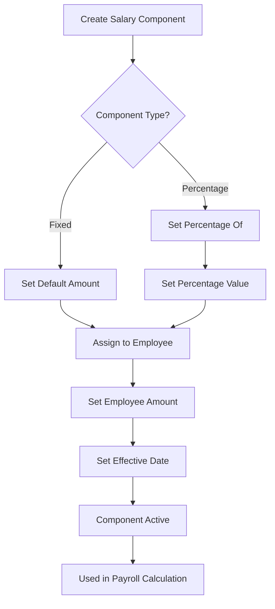
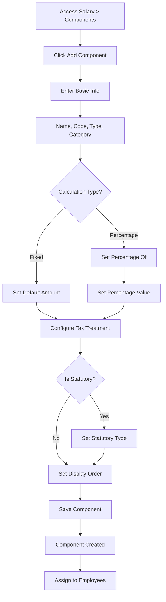

# Salary Components Configuration Guide

## Table of Contents

1. [Introduction](#introduction)
2. [Accessing Salary Components](#accessing-salary-components)
3. [Understanding Component Types](#understanding-component-types)
4. [Creating Salary Components](#creating-salary-components)
5. [Common Salary Components Setup](#common-salary-components-setup)
6. [Assigning Components to Employees](#assigning-components-to-employees)
7. [Component Calculation Types](#component-calculation-types)
8. [Tax Treatment](#tax-treatment)
9. [Best Practices](#best-practices)
10. [Troubleshooting](#troubleshooting)

## Introduction

### What are Salary Components?

Salary components are the building blocks of an employee's compensation package. They define:
- **Earnings**: Money added to the employee's pay (e.g., Basic Salary, Allowances)
- **Deductions**: Money subtracted from the employee's pay (e.g., Taxes, Loans, Advances)

### Why They're Important

Salary components allow you to:
- **Structure Compensation**: Define how employees are paid
- **Calculate Payroll**: System uses components to calculate gross pay, deductions, and net pay
- **Track Taxes**: Identify taxable vs non-taxable income
- **Manage Deductions**: Track loans, advances, and other deductions
- **Generate Reports**: Analyze compensation by component type

### How They Work

1. **Create Components**: Define reusable salary components (e.g., "Basic Salary", "Transport Allowance")
2. **Assign to Employees**: Link components to specific employees with amounts
3. **Calculate Payroll**: System automatically calculates gross pay and deductions
4. **Generate Payslips**: Components appear on employee payslips

## Accessing Salary Components

### Navigation

1. Log in to the system as an Administrator
2. Navigate to **Salary** menu in the sidebar
3. Click on **Components**

Alternatively, you can access it directly at: `/salary/components`

### Permissions Required

- You must have the `salary:components:view` permission to view
- You must have the `salary:components:manage` permission to create/edit/delete
- Admin role typically has all permissions by default

## Understanding Component Types

### Earnings vs Deductions

**Earnings** (`type: "earning"`):
- Money added to employee's pay
- Examples: Basic Salary, Transport Allowance, House Allowance, Bonuses
- Sum of all earnings = Gross Pay

**Deductions** (`type: "deduction"`):
- Money subtracted from employee's pay
- Examples: PAYE, NSSF, NHIF, Loans, Advances, Insurance
- Sum of all deductions = Total Deductions

### Component Categories

Components are organized into categories for better management:

- **Basic**: Core salary components (e.g., Basic Salary)
- **Allowance**: Additional benefits (e.g., Transport, House, Medical)
- **Statutory**: Government-mandated deductions (e.g., PAYE, NSSF, NHIF)
- **Internal**: Company-specific deductions (e.g., Loans, Advances, Insurance)

**Note**: Statutory deductions (PAYE, NSSF, NHIF) are typically calculated automatically by the system based on statutory rates. You may still create components for them for display purposes, but they should be marked as `isStatutory: true`.

## Creating Salary Components

### Step-by-Step Process

#### Step 1: Navigate to Components Page

1. Go to **Salary > Components**
2. Click **"Add Component"** or **"Create Component"** button

#### Step 2: Fill in Basic Information

**Required Fields:**
- **Name**: Descriptive name (e.g., "Basic Salary", "Transport Allowance")
- **Code**: Unique identifier (e.g., "BASIC", "TRANS", "HOUSE")
  - Must be unique within your organization
  - Use uppercase letters and underscores
  - Examples: `BASIC`, `TRANSPORT_ALLOWANCE`, `HOUSE_ALLOWANCE`
- **Type**: Select `earning` or `deduction`
- **Category**: Select appropriate category

**Optional Fields:**
- **Display Order**: Number to control display order (lower numbers appear first)

#### Step 3: Configure Calculation

**Calculation Type**: Choose how the amount is determined

**Option 1: Fixed Amount** (`calculationType: "fixed"`)
- Component has a fixed value
- Set `defaultAmount` (optional, can be overridden per employee)
- Example: Basic Salary = KES 50,000

**Option 2: Percentage** (`calculationType: "percentage"`)
- Component calculated as percentage of another component
- Set `percentageOf` (reference to another component ID)
- Set `percentageValue` (percentage rate, e.g., 10 for 10%)
- Example: Transport Allowance = 10% of Basic Salary

#### Step 4: Configure Tax Treatment

**Is Taxable** (`isTaxable`):
- `true`: Component is included in taxable income (affects PAYE calculation)
- `false`: Component is excluded from taxable income
- Default: `true` for earnings, `false` for deductions

**Examples:**
- Basic Salary: `isTaxable: true` (included in PAYE calculation)
- Medical Allowance: `isTaxable: false` (excluded from PAYE calculation)
- Transport Allowance: `isTaxable: true` (included in PAYE calculation)

#### Step 5: Statutory Component Flag

**Is Statutory** (`isStatutory`):
- `true`: Component represents a statutory deduction (PAYE, NSSF, NHIF)
- `false`: Regular component
- Default: `false`

**Statutory Type** (`statutoryType`):
- Only relevant if `isStatutory: true`
- Values: `"paye"`, `"nssf"`, `"nhif"`
- Used for identification and reporting

**Important**: Statutory deductions are calculated automatically by the system. You may create components for display purposes, but the actual amounts come from statutory rate calculations.

#### Step 6: Save Component

1. Review all fields
2. Click **"Save"** or **"Create"**
3. Component appears in the list

### Component Fields Reference

| Field | Type | Required | Description |
|-------|------|----------|-------------|
| `name` | String | Yes | Component name (e.g., "Basic Salary") |
| `code` | String | Yes | Unique code (e.g., "BASIC") |
| `type` | Enum | Yes | `"earning"` or `"deduction"` |
| `category` | String | Yes | Category (e.g., "basic", "allowance") |
| `calculationType` | Enum | Yes | `"fixed"` or `"percentage"` |
| `defaultAmount` | Number | No | Default amount (for fixed type) |
| `percentageOf` | UUID | No | Component ID to calculate percentage from |
| `percentageValue` | Number | No | Percentage rate (e.g., 10 for 10%) |
| `isTaxable` | Boolean | No | Whether component is taxable (default: true) |
| `isStatutory` | Boolean | No | Whether component is statutory (default: false) |
| `statutoryType` | String | No | `"paye"`, `"nssf"`, or `"nhif"` (if statutory) |
| `isActive` | Boolean | No | Whether component is active (default: true) |
| `displayOrder` | Number | No | Display order (default: 0) |

## Common Salary Components Setup

### 1. Basic Salary

**Purpose**: Core salary component, foundation for other calculations

**Configuration:**
```json
{
  "name": "Basic Salary",
  "code": "BASIC",
  "type": "earning",
  "category": "basic",
  "calculationType": "fixed",
  "defaultAmount": 50000,
  "isTaxable": true,
  "isStatutory": false,
  "isActive": true,
  "displayOrder": 1
}
```

**Notes:**
- Usually the largest earning component
- Typically taxable
- Used as base for percentage-based components

### 2. Transport Allowance

**Purpose**: Reimbursement for transportation costs

**Configuration:**
```json
{
  "name": "Transport Allowance",
  "code": "TRANSPORT",
  "type": "earning",
  "category": "allowance",
  "calculationType": "fixed",
  "defaultAmount": 5000,
  "isTaxable": true,
  "isStatutory": false,
  "isActive": true,
  "displayOrder": 2
}
```

**Alternative (Percentage-based):**
```json
{
  "name": "Transport Allowance",
  "code": "TRANSPORT",
  "type": "earning",
  "category": "allowance",
  "calculationType": "percentage",
  "percentageOf": "<BASIC_COMPONENT_ID>",
  "percentageValue": 10,
  "isTaxable": true,
  "isStatutory": false,
  "isActive": true,
  "displayOrder": 2
}
```

### 3. House Allowance

**Purpose**: Housing benefit

**Configuration:**
```json
{
  "name": "House Allowance",
  "code": "HOUSE",
  "type": "earning",
  "category": "allowance",
  "calculationType": "fixed",
  "defaultAmount": 15000,
  "isTaxable": true,
  "isStatutory": false,
  "isActive": true,
  "displayOrder": 3
}
```

### 4. Medical Allowance

**Purpose**: Medical benefit (often non-taxable)

**Configuration:**
```json
{
  "name": "Medical Allowance",
  "code": "MEDICAL",
  "type": "earning",
  "category": "allowance",
  "calculationType": "fixed",
  "defaultAmount": 3000,
  "isTaxable": false,
  "isStatutory": false,
  "isActive": true,
  "displayOrder": 4
}
```

**Note**: Medical allowances are often non-taxable in Kenya (check current tax laws).

### 5. PAYE Component (Display Only)

**Purpose**: Display PAYE deduction on payslips

**Configuration:**
```json
{
  "name": "PAYE",
  "code": "PAYE",
  "type": "deduction",
  "category": "statutory",
  "calculationType": "fixed",
  "defaultAmount": 0,
  "isTaxable": false,
  "isStatutory": true,
  "statutoryType": "paye",
  "isActive": true,
  "displayOrder": 10
}
```

**Important**: 
- Amount is calculated automatically by the system
- `defaultAmount` is ignored
- Used for display purposes only

### 6. NSSF Component (Display Only)

**Purpose**: Display NSSF deduction on payslips

**Configuration:**
```json
{
  "name": "NSSF",
  "code": "NSSF",
  "type": "deduction",
  "category": "statutory",
  "calculationType": "fixed",
  "defaultAmount": 0,
  "isTaxable": false,
  "isStatutory": true,
  "statutoryType": "nssf",
  "isActive": true,
  "displayOrder": 11
}
```

### 7. NHIF Component (Display Only)

**Purpose**: Display NHIF deduction on payslips

**Configuration:**
```json
{
  "name": "NHIF",
  "code": "NHIF",
  "type": "deduction",
  "category": "statutory",
  "calculationType": "fixed",
  "defaultAmount": 0,
  "isTaxable": false,
  "isStatutory": true,
  "statutoryType": "nhif",
  "isActive": true,
  "displayOrder": 12
}
```

### 8. Loan Deduction

**Purpose**: Employee loan repayment

**Configuration:**
```json
{
  "name": "Loan Deduction",
  "code": "LOAN",
  "type": "deduction",
  "category": "internal",
  "calculationType": "fixed",
  "defaultAmount": 0,
  "isTaxable": false,
  "isStatutory": false,
  "isActive": true,
  "displayOrder": 20
}
```

**Note**: Loan amounts are typically managed through the Loans module and automatically deducted.

### 9. Advance Deduction

**Purpose**: Salary advance repayment

**Configuration:**
```json
{
  "name": "Advance Deduction",
  "code": "ADVANCE",
  "type": "deduction",
  "category": "internal",
  "calculationType": "fixed",
  "defaultAmount": 0,
  "isTaxable": false,
  "isStatutory": false,
  "isActive": true,
  "displayOrder": 21
}
```

## Assigning Components to Employees

### Accessing Employee Salary Page

1. Navigate to **Employees** page
2. Click on an employee
3. Go to **Salary** tab
4. Or navigate directly: `/employees/:employeeId/salary`

### Adding Components to Employees

#### Step 1: Select Components

1. Click **"Add Component"** or **"Assign Components"**
2. Select salary components from the list
3. Enter amount for each component (if fixed type)
4. Set **Effective From** date (when this salary structure becomes active)

#### Step 2: Configure Amounts

**For Fixed Components:**
- Enter the amount directly
- This overrides the component's `defaultAmount`

**For Percentage Components:**
- Amount is calculated automatically
- Based on the referenced component's amount
- Example: If Transport = 10% of Basic, and Basic = 50,000, then Transport = 5,000

#### Step 3: Set Effective Dates

**Effective From**: 
- Date when this salary structure becomes active
- Format: YYYY-MM-DD
- Default: Today's date

**Effective To**:
- Optional end date
- Leave empty for ongoing salary
- Set if salary changes in the future

#### Step 4: Save Assignment

1. Review all components and amounts
2. Click **"Save"** or **"Assign"**
3. Components are now linked to the employee

### Viewing Salary History

The Employee Salary page shows:
- **Current Salary**: Active components and amounts
- **Salary History**: Historical salary changes with effective dates
- **Component Breakdown**: Detailed view of each component

### Updating Employee Salary

1. Go to Employee Salary page
2. Click **"Edit"** or **"Update Salary"**
3. Modify components or amounts
4. Set new **Effective From** date
5. Save

**Important**: 
- Old salary structure remains in history
- New structure becomes active from the effective date
- System automatically handles transitions

## Component Calculation Types

### Fixed Amount Calculation

**When to Use:**
- Component has a constant value
- Amount doesn't depend on other components
- Examples: Basic Salary, Fixed Allowances

**How It Works:**
1. Component has a `defaultAmount` (optional)
2. When assigned to employee, you can override with specific amount
3. Amount remains constant until changed

**Example:**
- Basic Salary component: `defaultAmount: 50000`
- Assigned to Employee A: Amount = 50,000
- Assigned to Employee B: Amount = 75,000 (override)

### Percentage Calculation

**When to Use:**
- Component is a percentage of another component
- Amount should adjust automatically when base component changes
- Examples: Transport = 10% of Basic, Bonus = 20% of Basic

**How It Works:**
1. Component references another component (`percentageOf`)
2. Sets percentage rate (`percentageValue`)
3. Amount calculated as: `referencedAmount × (percentageValue / 100)`

**Example:**
- Basic Salary: 50,000
- Transport Allowance: 10% of Basic
- Calculation: 50,000 × 10% = 5,000
- If Basic changes to 60,000, Transport automatically becomes 6,000

**Setup Requirements:**
- Referenced component must be assigned to the employee first
- Percentage component must be assigned after the base component
- Circular references are not allowed

### Component Assignment Flow



### Salary Structure Setup Flow


## Tax Treatment

### Understanding Taxable Income

**Taxable Income** = Gross Pay - Non-Taxable Components

The system calculates taxable income by:
1. Summing all earning components
2. Subtracting non-taxable earning components
3. Using this amount for PAYE calculation

### Taxable vs Non-Taxable Components

**Taxable Components** (`isTaxable: true`):
- Included in taxable income
- Subject to PAYE
- Examples: Basic Salary, Transport Allowance, House Allowance

**Non-Taxable Components** (`isTaxable: false`):
- Excluded from taxable income
- Not subject to PAYE
- Examples: Medical Allowance (if non-taxable), Some benefits

### Impact on PAYE Calculation

**Example 1: All Taxable**
- Basic Salary: 50,000 (taxable)
- Transport: 5,000 (taxable)
- House: 15,000 (taxable)
- **Taxable Income**: 70,000
- **PAYE**: Calculated on 70,000

**Example 2: Mixed**
- Basic Salary: 50,000 (taxable)
- Transport: 5,000 (taxable)
- Medical: 3,000 (non-taxable)
- **Taxable Income**: 55,000 (Medical excluded)
- **PAYE**: Calculated on 55,000

### Best Practices for Tax Treatment

1. **Check Current Tax Laws**: Tax treatment may vary by country and change over time
2. **Document Non-Taxable Components**: Clearly mark why components are non-taxable
3. **Review Regularly**: Tax laws change, review components periodically
4. **Consult Tax Advisor**: For complex situations, consult a tax professional

## Best Practices

### Component Naming

**Good Names:**
- "Basic Salary"
- "Transport Allowance"
- "House Allowance"
- "Medical Allowance"
- "PAYE"
- "NSSF"
- "NHIF"

**Avoid:**
- Generic names like "Component 1"
- Abbreviations without context
- Duplicate names

### Code Naming

**Good Codes:**
- `BASIC`
- `TRANSPORT_ALLOWANCE`
- `HOUSE_ALLOWANCE`
- `MEDICAL_ALLOWANCE`
- `PAYE`
- `NSSF`
- `NHIF`

**Conventions:**
- Use UPPERCASE
- Use underscores for multi-word codes
- Keep codes short but descriptive
- Make codes unique and meaningful

### Organization

1. **Group by Category**: Use categories to organize components
2. **Set Display Order**: Control how components appear on payslips
3. **Use Consistent Naming**: Follow a naming convention
4. **Document Components**: Add descriptions for complex components

### Maintenance

1. **Review Regularly**: Check components are still relevant
2. **Deactivate Unused**: Don't delete, deactivate unused components
3. **Update Amounts**: Keep default amounts current
4. **Monitor Changes**: Track when components are added/modified

## Troubleshooting

### Issue: Component not appearing in employee salary

**Causes:**
1. Component is inactive
2. Component not assigned to employee
3. Effective date hasn't been reached
4. Effective date has expired

**Solutions:**
1. Check component `isActive` status
2. Verify component is assigned to employee
3. Check effective dates (from/to)
4. Ensure current date is within effective range

### Issue: Percentage component showing 0

**Causes:**
1. Referenced component not assigned to employee
2. Referenced component amount is 0
3. Percentage calculation error

**Solutions:**
1. Assign referenced component first
2. Verify referenced component has amount > 0
3. Check percentage configuration (percentageOf, percentageValue)
4. Review calculation logic

### Issue: Wrong tax calculation

**Causes:**
1. Component tax treatment incorrect
2. Non-taxable components marked as taxable
3. Taxable components marked as non-taxable

**Solutions:**
1. Review `isTaxable` flag for all components
2. Verify taxable income calculation
3. Check statutory rates are configured
4. Test with sample employee

### Issue: Component amount not updating

**Causes:**
1. Fixed amount override not saved
2. Percentage base component changed but percentage not recalculated
3. Effective date issue

**Solutions:**
1. Re-save employee salary assignment
2. Reprocess payroll to recalculate percentages
3. Check effective dates
4. Verify component configuration

## Quick Reference

### API Endpoints

- **Get Components**: `GET /api/salary-components`
- **Create Component**: `POST /api/salary-components`
- **Update Component**: `PUT /api/salary-components/:id`
- **Delete Component**: `DELETE /api/salary-components/:id`
- **Get Employee Salary**: `GET /api/employees/:employeeId/salary`
- **Assign Components**: `POST /api/employees/:employeeId/salary/components`

### Common Component Templates

See the [Common Salary Components Setup](#common-salary-components-setup) section for ready-to-use configurations.

## Visual Reference: Component Creation Flow



## Next Steps

After setting up salary components:

1. **Assign to Employees**: Link components to employees with amounts
2. **Configure Statutory Rates**: Set up PAYE, NSSF, NHIF rates (see [Statutory Rates Guide](./STATUTORY_RATES_GUIDE.md))
3. **Test Payroll**: Process a test payroll to verify calculations
4. **Review Payslips**: Check that components appear correctly on payslips

For more information, see:
- [Statutory Rates Guide](./STATUTORY_RATES_GUIDE.md)
- [Complete System Guide](./COMPLETE_SYSTEM_GUIDE.md)
- [Troubleshooting Guide](./TROUBLESHOOTING_GUIDE.md)
- [Configuration Templates](./CONFIGURATION_TEMPLATES.md) - Ready-to-use JSON templates
- [Configuration Templates](./CONFIGURATION_TEMPLATES.md)
