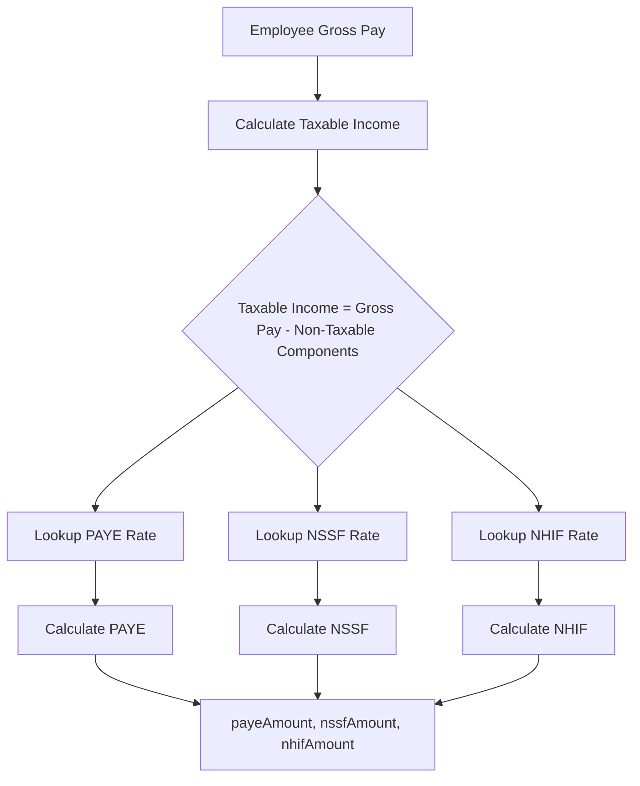
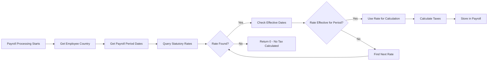

# Statutory Rates Configuration Guide

## Table of Contents

1. [Introduction](#introduction)
2. [Accessing Statutory Rates](#accessing-statutory-rates)
3. [Configuring PAYE (Pay As You Earn)](#configuring-paye)
4. [Configuring NSSF (National Social Security Fund)](#configuring-nssf)
5. [Configuring NHIF (National Hospital Insurance Fund)](#configuring-nhif)
6. [Rate Management](#rate-management)
7. [Connection to Payroll](#connection-to-payroll)
8. [Troubleshooting](#troubleshooting)

## Introduction

### What are Statutory Rates?

Statutory rates are government-mandated tax and contribution rates that must be deducted from employee salaries. In Kenya, these include:

- **PAYE (Pay As You Earn)**: Income tax calculated based on taxable income brackets
- **NSSF (National Social Security Fund)**: Social security contribution (currently 6% of gross pay, capped)
- **NHIF (National Hospital Insurance Fund)**: Health insurance contribution based on salary tiers

### Why They're Needed

Statutory rates are essential for:
- **Legal Compliance**: Ensuring your organization complies with tax laws
- **Accurate Payroll**: Calculating correct deductions for employees
- **Tax Reporting**: Generating accurate tax reports and remittances
- **Employee Benefits**: Enabling employees to access NSSF and NHIF benefits

### How They Connect to Payroll

When processing payroll, the system:
1. Retrieves the employee's gross pay and taxable income
2. Looks up the applicable statutory rates based on:
   - Employee's country (defaults to "Kenya")
   - Payroll period date (uses rate effective for that date)
3. Calculates PAYE, NSSF, and NHIF based on the rate configuration
4. Stores the calculated amounts in the payroll record

**Important**: If statutory rates are not configured, tax calculations will return 0, resulting in incorrect payroll amounts.

## Accessing Statutory Rates

### Navigation

1. Log in to the system as an Administrator
2. Navigate to **Admin** menu in the sidebar
3. Click on **Statutory Rates**

Alternatively, you can access it directly at: `/admin/statutory-rates`

### Permissions Required

- You must have the `settings:statutory-rates:manage` permission
- Admin role typically has all permissions by default

## Configuring PAYE (Pay As You Earn)

### Understanding PAYE Structure

PAYE in Kenya uses a progressive tax bracket system:
- Different income ranges have different tax rates
- Personal relief is deducted from the calculated tax
- The system calculates tax for each bracket the employee's income falls into

### Current Kenya PAYE Brackets (2024)

| Income Range (KES) | Tax Rate |
|-------------------|----------|
| 0 - 24,000 | 10% |
| 24,001 - 32,333 | 25% |
| 32,334 and above | 30% |

**Personal Relief**: KES 2,400 per month

### Step-by-Step PAYE Configuration

#### Step 1: Create New PAYE Rate

1. On the Statutory Rates page, click **"Add Rate"** or **"Create Rate"**
2. Fill in the form:
   - **Rate Type**: Select `paye`
   - **Country**: Enter `Kenya` (or your country)
   - **Effective From**: Enter the date when this rate becomes effective (e.g., `2024-01-01`)
   - **Effective To**: Leave empty for ongoing rates, or set end date if rate changes

#### Step 2: Configure PAYE Brackets

In the **Config** field, enter the following JSON structure:

```json
{
  "brackets": [
    {
      "min": 0,
      "max": 24000,
      "rate": 10
    },
    {
      "min": 24001,
      "max": 32333,
      "rate": 25
    },
    {
      "min": 32334,
      "max": null,
      "rate": 30
    }
  ],
  "personalRelief": 2400
}
```

**Field Explanations:**
- `brackets`: Array of tax brackets
  - `min`: Minimum income for this bracket (0 for first bracket)
  - `max`: Maximum income for this bracket (`null` for highest bracket)
  - `rate`: Tax percentage for this bracket
- `personalRelief`: Monthly personal relief amount (KES 2,400 in Kenya)

#### Step 3: Save and Verify

1. Click **"Save"** or **"Create"**
2. Verify the rate appears in the list
3. Check that `isActive` is set to `true`

### Example PAYE Calculation

For an employee with taxable income of KES 50,000:

1. **First Bracket** (0 - 24,000): 24,000 × 10% = 2,400
2. **Second Bracket** (24,001 - 32,333): 8,333 × 25% = 2,083.25
3. **Third Bracket** (32,334 - 50,000): 17,666 × 30% = 5,299.80
4. **Total Tax**: 2,400 + 2,083.25 + 5,299.80 = 9,783.05
5. **Less Personal Relief**: 9,783.05 - 2,400 = **7,383.05**

## Configuring NSSF (National Social Security Fund)

### Understanding NSSF Structure

NSSF is a percentage-based contribution:
- Currently 6% of gross pay in Kenya
- Capped at a maximum contribution amount (KES 1,080 per month for Tier 1)
- Both employee and employer contribute (employee portion is deducted)

### Current Kenya NSSF Rates (2024)

- **Rate**: 6% of gross pay
- **Maximum Contribution Base**: KES 18,000 (Tier 1)
- **Maximum Employee Contribution**: KES 1,080 per month

### Step-by-Step NSSF Configuration

#### Step 1: Create New NSSF Rate

1. Click **"Add Rate"** on the Statutory Rates page
2. Fill in the form:
   - **Rate Type**: Select `nssf`
   - **Country**: Enter `Kenya`
   - **Effective From**: Enter the effective date

#### Step 2: Configure NSSF Rate

In the **Config** field, enter:

```json
{
  "rate": 6,
  "maxAmount": 18000
}
```

**Field Explanations:**
- `rate`: Percentage rate (6% = 6)
- `maxAmount`: Maximum gross pay amount used for calculation (contributions capped at 6% of this amount)

#### Step 3: Save and Verify

1. Click **"Save"**
2. Verify the rate is active

### Example NSSF Calculation

For an employee with gross pay of KES 30,000:

1. **Contribution Base**: min(30,000, 18,000) = 18,000
2. **NSSF Contribution**: 18,000 × 6% = **1,080**

For an employee with gross pay of KES 15,000:

1. **Contribution Base**: min(15,000, 18,000) = 15,000
2. **NSSF Contribution**: 15,000 × 6% = **900**

## Configuring NHIF (National Hospital Insurance Fund)

### Understanding NHIF Structure

NHIF uses a tiered system based on gross pay:
- Different salary ranges have fixed contribution amounts
- Not a percentage - it's a fixed amount per tier
- Higher salary = higher contribution (up to a maximum)

### Current Kenya NHIF Rates (2024)

| Gross Pay Range (KES) | Monthly Contribution |
|----------------------|---------------------|
| 0 - 5,999 | 150 |
| 6,000 - 7,999 | 300 |
| 8,000 - 11,999 | 400 |
| 12,000 - 14,999 | 500 |
| 15,000 - 19,999 | 600 |
| 20,000 - 24,999 | 750 |
| 25,000 - 29,999 | 850 |
| 30,000 - 34,999 | 900 |
| 35,000 - 39,999 | 950 |
| 40,000 and above | 1,000 |

### Step-by-Step NHIF Configuration

#### Step 1: Create New NHIF Rate

1. Click **"Add Rate"** on the Statutory Rates page
2. Fill in the form:
   - **Rate Type**: Select `nhif`
   - **Country**: Enter `Kenya`
   - **Effective From**: Enter the effective date

#### Step 2: Configure NHIF Tiers

In the **Config** field, enter:

```json
{
  "tiers": [
    {
      "min": 0,
      "max": 5999,
      "amount": 150
    },
    {
      "min": 6000,
      "max": 7999,
      "amount": 300
    },
    {
      "min": 8000,
      "max": 11999,
      "amount": 400
    },
    {
      "min": 12000,
      "max": 14999,
      "amount": 500
    },
    {
      "min": 15000,
      "max": 19999,
      "amount": 600
    },
    {
      "min": 20000,
      "max": 24999,
      "amount": 750
    },
    {
      "min": 25000,
      "max": 29999,
      "amount": 850
    },
    {
      "min": 30000,
      "max": 34999,
      "amount": 900
    },
    {
      "min": 35000,
      "max": 39999,
      "amount": 950
    },
    {
      "min": 40000,
      "max": null,
      "amount": 1000
    }
  ]
}
```

**Field Explanations:**
- `tiers`: Array of salary tiers
  - `min`: Minimum gross pay for this tier
  - `max`: Maximum gross pay for this tier (`null` for highest tier)
  - `amount`: Fixed monthly contribution for this tier

#### Step 3: Save and Verify

1. Click **"Save"**
2. Verify the rate is active

### Example NHIF Calculation

For an employee with gross pay of KES 25,000:

- Falls in tier: 25,000 - 29,999
- **NHIF Contribution**: **850**

For an employee with gross pay of KES 45,000:

- Falls in tier: 40,000 and above
- **NHIF Contribution**: **1,000**

## Rate Management

### Creating New Rates

1. Navigate to Admin > Statutory Rates
2. Click **"Add Rate"** or **"Create Rate"**
3. Fill in all required fields
4. Enter the configuration JSON
5. Click **"Save"**

### Updating Existing Rates

1. Find the rate in the list
2. Click the **Edit** icon
3. Modify the fields as needed
4. Click **"Update"**

**Important Notes:**
- You cannot deactivate a rate if there are active payroll periods using it
- Updating a rate affects future payroll calculations only
- Historical payrolls retain their original calculations

### Setting Effective Dates

**Effective From**: The date when this rate becomes active
- Must be a valid date
- Should not overlap with existing active rates of the same type
- Use format: `YYYY-MM-DD` (e.g., `2024-01-01`)

**Effective To**: The date when this rate expires (optional)
- Leave empty for ongoing rates
- Set if the rate changes and you need historical tracking
- When a rate expires, the system uses the most recent active rate

### Deactivating Rates

1. Find the rate you want to deactivate
2. Click **Edit**
3. Set `isActive` to `false`
4. Save

**Restrictions:**
- Cannot deactivate if there are active payroll periods
- Cannot deactivate if it's the only active rate for that type

### Historical Rate Tracking

The system maintains a history of all rates:
- You can see when rates were created and updated
- Effective dates show the period each rate was active
- This helps with audit trails and historical payroll accuracy

## Connection to Payroll

### How Rates Are Selected

When processing payroll, the system:

1. **Gets Employee Country**: Retrieves the employee's country (defaults to "Kenya")
2. **Determines Payroll Period Date**: Uses the payroll period's end date
3. **Finds Applicable Rate**: 
   - Looks for active rates matching the country and rate type
   - Selects the rate where:
     - `effectiveFrom <= payrollPeriodEndDate`
     - `effectiveTo IS NULL OR effectiveTo >= payrollPeriodStartDate`
   - If multiple rates match, uses the most recent one (by `effectiveFrom`)

### Calculation Flow



### Rate Selection Process



### What Happens If Rates Are Missing?

If statutory rates are not configured:

1. **PAYE Calculation**: Returns 0 (no tax calculated)
2. **NSSF Calculation**: Returns 0 (no contribution calculated)
3. **NHIF Calculation**: Returns 0 (no contribution calculated)
4. **Payroll Record**: Stores 0 for all tax amounts
5. **Tax Reports**: Show 0 totals
6. **Tax Remittances**: Cannot be created (no amounts to remit)

**Warning Signs:**
- All tax amounts are 0.00 in payroll records
- Tax summary reports show 0 for PAYE, NSSF, NHIF
- Debug logs show "No PAYE/NSSF/NHIF rates found"

### Best Practices

1. **Configure Rates Before Processing Payroll**
   - Set up all three rates (PAYE, NSSF, NHIF) before creating payroll periods
   - Verify rates are active and have correct effective dates

2. **Test Calculations**
   - Process a test payroll for one employee
   - Verify tax amounts match expected calculations
   - Check that rates are being applied correctly

3. **Keep Rates Updated**
   - Monitor for rate changes from tax authorities
   - Update rates when new regulations come into effect
   - Set effective dates correctly to avoid gaps

4. **Document Rate Changes**
   - Add notes when creating/updating rates
   - Keep records of when rates changed
   - Maintain audit trail for compliance

## Troubleshooting

### Issue: Tax amounts are 0 in payroll

**Symptoms:**
- All payroll records show PAYE = 0, NSSF = 0, NHIF = 0
- Tax summary reports show zero totals

**Causes:**
1. Statutory rates not configured
2. Rates are inactive
3. Effective dates don't match payroll period dates
4. Country mismatch (employee country doesn't match rate country)

**Solutions:**
1. Check if rates exist: Go to Admin > Statutory Rates
2. Verify rates are active: Check `isActive = true`
3. Check effective dates: Ensure rates are effective for the payroll period
4. Verify country: Ensure employee country matches rate country
5. Recalculate payroll: After fixing rates, reprocess the payroll period

### Issue: Wrong tax amounts calculated

**Symptoms:**
- Tax amounts don't match expected calculations
- Different employees with same salary have different taxes

**Causes:**
1. Incorrect rate configuration (wrong brackets/percentages)
2. Using wrong rate (old rate instead of new one)
3. Taxable income calculation issue

**Solutions:**
1. Review rate configuration: Check brackets, rates, and amounts
2. Verify correct rate is being used: Check effective dates
3. Check taxable income: Review employee salary components (non-taxable components reduce taxable income)
4. Test calculation manually: Compare with system calculation

### Issue: Cannot deactivate rate

**Symptoms:**
- Error message when trying to deactivate a rate
- "Cannot deactivate rate while there are active payroll periods"

**Causes:**
- Active payroll periods exist that use this rate

**Solutions:**
1. Complete or cancel active payroll periods
2. Or create a new rate with future effective date
3. The old rate will automatically stop being used when new rate becomes effective

### Issue: Multiple rates for same period

**Symptoms:**
- Confusion about which rate is being used
- Unexpected tax calculations

**Causes:**
- Multiple active rates with overlapping effective dates

**Solutions:**
1. Review all rates for the rate type
2. Ensure only one rate is active for any given date
3. Set `effectiveTo` dates to prevent overlaps
4. Deactivate old rates when creating new ones

## Quick Reference

### API Endpoints

- **Get Rates**: `GET /api/settings/statutory-rates?country=Kenya`
- **Create Rate**: `POST /api/settings/statutory-rates`
- **Update Rate**: `PUT /api/settings/statutory-rates/:id`
- **Delete Rate**: `DELETE /api/settings/statutory-rates/:id`

### Required Fields

- `rateType`: "paye" | "nssf" | "nhif"
- `country`: String (e.g., "Kenya")
- `effectiveFrom`: Date (YYYY-MM-DD)
- `config`: JSON object with rate configuration

### Configuration Templates

**PAYE:**
```json
{
  "brackets": [
    {"min": 0, "max": 24000, "rate": 10},
    {"min": 24001, "max": 32333, "rate": 25},
    {"min": 32334, "max": null, "rate": 30}
  ],
  "personalRelief": 2400
}
```

**NSSF:**
```json
{
  "rate": 6,
  "maxAmount": 18000
}
```

**NHIF:**
```json
{
  "tiers": [
    {"min": 0, "max": 5999, "amount": 150},
    {"min": 6000, "max": 7999, "amount": 300},
    {"min": 8000, "max": 11999, "amount": 400},
    {"min": 12000, "max": 14999, "amount": 500},
    {"min": 15000, "max": 19999, "amount": 600},
    {"min": 20000, "max": 24999, "amount": 750},
    {"min": 25000, "max": 29999, "amount": 850},
    {"min": 30000, "max": 34999, "amount": 900},
    {"min": 35000, "max": 39999, "amount": 950},
    {"min": 40000, "max": null, "amount": 1000}
  ]
}
```

## Next Steps

After configuring statutory rates:

1. **Verify Configuration**: Test with a sample employee
2. **Process Test Payroll**: Create a test payroll period and verify calculations
3. **Review Tax Summary**: Check that tax amounts appear correctly in reports
4. **Set Up Tax Remittances**: Configure tax remittance tracking (see Tax Remittances Guide)

For more information, see:
- [Salary Components Guide](./SALARY_COMPONENTS_GUIDE.md)
- [Complete System Guide](./COMPLETE_SYSTEM_GUIDE.md)
- [Troubleshooting Guide](./TROUBLESHOOTING_GUIDE.md)
- [Configuration Templates](./CONFIGURATION_TEMPLATES.md) - Ready-to-use JSON templates
